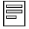
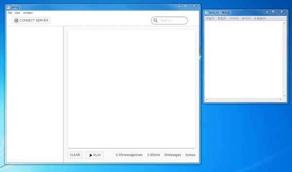

# Remolog(Remote Log) 

<div align="center" >



</div>

This is file monitoring app, [Create React App](https://reactjs.org/docs/create-a-new-react-app.html) Project.  
Uses [Electron](http://electron.atom.io/), [React](https://reactjs.org/), [Redux](https://github.com/reactjs/redux), [Socket.io](https://socket.io/), [Material-ui](https://material-ui.com/), [Webpack](https://webpack.js.org/)   

<div style="background-color: white; vertical-align: center" align="center" >

[](http://electron.atom.io/)
[](https://reactjs.org/)
[](https://github.com/reactjs/redux)
[](https://socket.io/)
[](https://material-ui.com/)
[](https://webpack.js.org/)

</div>

---

## Use
Install Setup.exe file form here (https://github.com/devyonghee/remolog/releases).
It will update automatically when release new version.

## Install For Development
1. clone the repository
```bash 
git clone -b master --single-branch https://github.com/devyonghee/remolog.git project-name
```

2. install the dependencies 
```
cd project-name
npm install
```

## Development
```bash
npm start
```

## Packaging
To package apps for the local platform:
```bash
npm package
```

## Server For Watching (node version >= 10.10.0)
### install 
```bash 
cd server
npm install
```

### start
```bash
npm start
```

### start for Development
```bash 
npm run dev
```

### Configs

#### host
websocket network host
#### port
websocket network port
#### authUrl
login check url
#### secretKey
secret key for jwt(json web token) 
#### rootDirectory
Root directory for observing server file  
#### extensions
File extensions Allowed for observation
